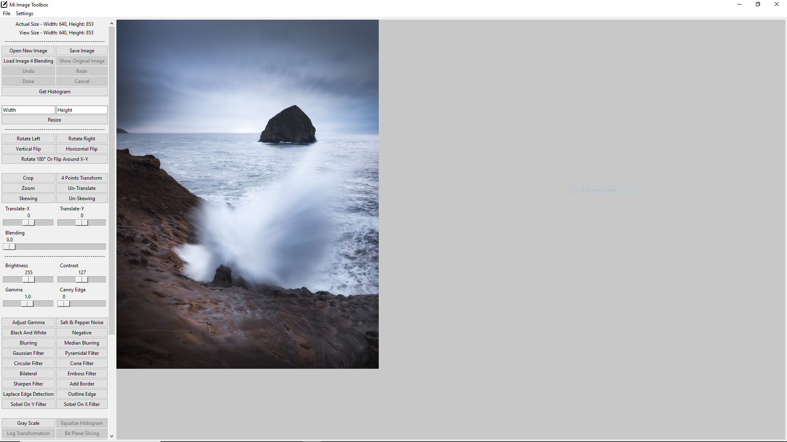

# **Mi Image Toolbox Installation Guide**
___
Mi Image Toolbox is a Desktop App Implemented As Simple Image Editor.

* Edge Detection

## Project Setup
___
### Install Python 3.x
Mi Image Toolbox requires that you have Python 3.x installed. 
You can download Python from its [Official Site][1]

- I recommend using [PyCharm IDE][2] because it's very simple.

### Download Source Code
* Downloading a zip file

From link on [My Google Drive][3]. Click the folder name '**ImgProcessing**' above, and it will show a '**Dropdown Menu**'
then choose download to download a zip file to your Computer. Then open "**Main.py**" file with your **IDE** and run it.

* Downloading each file separately

From above link choose to download file by file but be careful with "**img**" folder because it contains 
"**icon.png**" that it Will Make The App Crashes if It is not available in "**Main.py**" path folder. 
And "**imageScripts.py**" which includes all of **OpenCV** required functions.

### Get The Required Packages
* Use pip to install the required files: 

`pip install -r requirements.txt`

* Enter this commands in "**Python Terminal**": 

`pip install opencv-python`,    
`pip install matplotlib`,   
`pip install numpy`,    
`pip install Pillow`,   
`pip install scipy`

[1]: https://www.python.org/ 
[2]: https://www.jetbrains.com/pycharm/
[3]: https://drive.google.com/drive/folders/1ht6lQk2k1Yu5f8ley_5e74yr22EhrUk3?usp=sharing 
